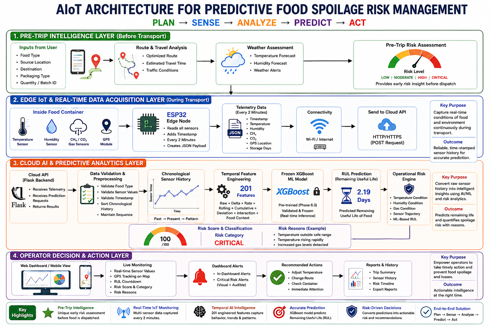
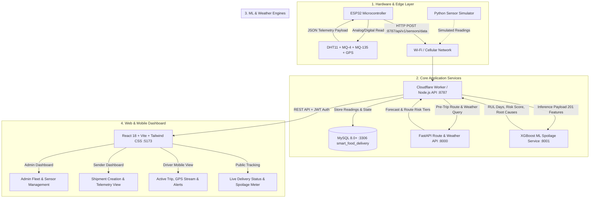

# 🥗 AIoT Predictive Food Spoilage & Cold-Chain Logistics Platform

[](https://nodejs.org/)
[](https://python.org/)
[](https://www.mysql.com/)
[](https://reactjs.org/)
[](https://xgboost.readthedocs.io/)
[](https://www.espressif.com/)

An enterprise-grade, end-to-end intelligent cold-chain logistics platform combining **real-time IoT hardware telemetry (ESP32)**, **201-feature XGBoost food spoilage predictive modeling**, **automated route & weather risk analytics**, and a **multi-role responsive management dashboard** (Admin, Sender, Driver, and Public Tracking).

The system operates on the core lifecycle paradigm:  
**`PLAN` ➔ `SENSE` ➔ `ANALYZE` ➔ `PREDICT` ➔ `ACT`**

---

## 🏛️ System Architecture



The platform is designed around 4 interconnected architectural layers to ensure zero food waste and complete supply chain transparency:

### 1. Pre-Trip Intelligence Layer (Before Transport — `PLAN`)
* **Sender / Merchant Inputs**: Food Category (Milk, Meat, Strawberries, Tomatoes, Leafy Greens, Fish, etc.), Origin, Destination, Packaging Type, Batch Quantity.
* **Route & Travel Analysis**: Leverages OSRM routing engine to compute optimal pathing, road conditions, and dynamic transit duration.
* **Weather Assessment**: Queries Open-Meteo forecast API for ambient temperature, humidity levels, and thermal risk along the transit corridor.
* **Pre-Trip Spoilage Risk Score**: Predicts baseline risk tier (**LOW**, **MODERATE**, **HIGH**, **CRITICAL**) *prior to vehicle departure*, allowing senders to adjust cooling or packaging in advance.

### 2. Edge IoT & Real-Time Data Acquisition Layer (During Transport — `SENSE`)
* **Container Sensor Array**:
  * **DHT11 / DHT22**: In-transit temperature and relative humidity.
  * **MQ-4 Gas Sensor**: Methane ($\text{CH}_4$) decomposition gas detection.
  * **MQ-135 Gas Sensor**: Carbon dioxide ($\text{CO}_2$), ammonia, and volatile organic compound (VOC) buildup.
  * **GY-GPS6MV2 (NEO-6M)**: High-precision GPS coordinates, speed, and heading.
* **ESP32 Edge Microcontroller**: Aggregates all sensor pins, performs hardware smoothing, attaches timestamps, and dispatches JSON telemetry packets every 2 minutes over Wi-Fi / Cellular to the backend API via HTTP/HTTPS POST.

### 3. Cloud AI & Predictive Analytics Layer (`ANALYZE` & `PREDICT`)
* **Backend Ingestion API**: Cloudflare Worker / Node.js Hono microservice listening on port `8787` (binds `0.0.0.0`), authenticating requests with device API keys.
* **Temporal Feature Engineering (201 Features)**: Extracts raw readings, 1st & 2nd order deltas, thermal acceleration rates, cumulative temperature abuse, rolling statistical windows, gas concentration slopes, and interactions against food baseline tolerance profiles.
* **Frozen XGBoost Machine Learning Cluster**: 15 distinct, pre-trained, validated models mapped to specific food commodities for sub-second inference.
* **RUL (Remaining Useful Life) Engine**: Computes exact countdown hours/days before spoilage threshold breach.
* **Operational Risk Engine**: Calculates a normalized Composite Spoilage Risk Score (0–100), categorizes risk level, and generates transparent root-cause reasons (e.g., *"Temperature rising rapidly (+3.4°C/hr)"*, *"Elevated methane gas detected (0.048 ppm)"*).

### 4. Operator Decision & Action Layer (`ACT`)
* **Role-Based Portals**: Dedicated interfaces for System Administrators, Senders (Producers/Merchants), Fleet Drivers, and End Customers.
* **Live Fleet Monitoring**: Real-time Leaflet interactive GPS map with color-coded risk breadcrumbs and temperature heatmaps.
* **Smart Alerting System**: Audio-visual in-dashboard notifications dispatched immediately when critical thresholds are breached.
* **Prescriptive Recommended Actions**: Automated recommendations (e.g., *"Adjust refrigeration to 4°C"*, *"Reroute to nearest cold-storage facility"*, *"Inspect container seals"*).
* **Audit & Compliance Reports**: Complete historical telemetry logs, ML prediction traces, and security event logs.

---

### Data Flow Diagram



---

## 🚀 Services Matrix & Port Allocations

| Service | Technology Stack | Port / URL | Working Directory | Purpose |
| :--- | :--- | :--- | :--- | :--- |
| **Frontend Web App** | React 18, Vite, TypeScript, Tailwind CSS, Leaflet, Recharts | `http://localhost:5173` | `/frontend` | Unified dashboard for Admin, Sender, Driver, and Public Tracker |
| **Worker Backend API** | Node.js, Hono, TypeScript, MySQL2, WebCrypto | `http://0.0.0.0:8787` | `/worker` | Core REST API, JWT auth, database persistence, telemetry ingestion |
| **MySQL Database** | MySQL 8.0+ / MariaDB / XAMPP | `127.0.0.1:3306` | `/database` | 11 relational tables (`smart_food_delivery`) |
| **ML Spoilage Model** | Python 3.10+, FastAPI, XGBoost, Scikit-Learn, Pandas | `http://127.0.0.1:8001` | `/ml_model` | 201-feature extraction, RUL prediction, and risk scoring |
| **Route Weather API** | Python 3.10+, FastAPI, Open-Meteo, OSRM | `http://127.0.0.1:8000` | `/weather-api` | Pre-trip travel time, weather forecast & road risk evaluation |
| **IoT Sensor Simulator** | Python 3.10+, Requests | Transmits to `:8787` | `/test` | Software simulator streaming real-time telemetry packets |
| **ESP32 Firmware** | C++ / Arduino (.ino), WiFiClient, ArduinoJson | Physical Device | `/esp32finalcode` | Microcontroller firmware for physical sensor readings |

---

## 📋 Prerequisites & Tools Required

Ensure you have the following installed on your operating system (Windows, macOS, or Linux):

1. **Git**: [Download Git](https://git-scm.com/downloads) (to clone and manage code)
2. **Node.js** (v18.x or v20.x LTS) & **npm**: [Download Node.js](https://nodejs.org/) (verify with `node -v` and `npm -v`)
3. **Python** (3.10 or higher): [Download Python](https://www.python.org/downloads/) (make sure to check **"Add Python to PATH"** during installation)
4. **MySQL Database Server** (Choose either Option A or Option B):
   * **Option A (Recommended)**: [MySQL Community Server 8.0+](https://dev.mysql.com/downloads/mysql/) or MySQL Installer.
   * **Option B (Easiest for Beginners)**: [XAMPP](https://www.apachefriends.org/) (with Apache & MySQL modules).
5. **Arduino IDE 2.x** *(Optional, only needed if flashing real ESP32 hardware)*: [Download Arduino IDE](https://www.arduino.cc/en/software).

---

## 🛠️ Step-by-Step Installation & Setup Guide

Follow this guide sequentially from cloning to launching all services.

---

### Step 1: Clone or Download the Project from GitHub

#### Option A: Using Git CLI (Recommended)
Open PowerShell or your command terminal and run:
```powershell
git clone https://github.com/your-username/smart-food-delivery.git c:\hackthon
cd c:\hackthon
```

#### Option B: Download as ZIP
1. Click the green **Code** button on GitHub and select **Download ZIP**.
2. Extract the ZIP archive into your desired directory (e.g., `C:\hackthon`).
3. Open your terminal in that folder:
   ```powershell
   cd c:\hackthon
   ```

---

### Step 2: Install & Configure MySQL Database

#### Method A: Using Native MySQL Server 8.0+
1. Install **MySQL Community Server 8.0+** or MySQL Installer.
2. During setup, remember your root password (e.g., `Karthik@2006` or `root`).
3. Ensure the MySQL service is running:
   ```powershell
   # Windows PowerShell (Run as Administrator if needed):
   Get-Service -Name "MySQL*"
   # Or start it manually:
   net start MySQL84   # Replace with your specific service name like MySQL80 / MySQL
   ```

#### Method B: Using XAMPP
1. Download and install [XAMPP](https://www.apachefriends.org/).
2. Open the **XAMPP Control Panel**.
3. Click the **Start** button next to **MySQL** (Default port is `3306`, default user is `root`, default password is empty `""`).

#### Automated Database Deployment & Seeding (Run Once)
The project includes an automated deployment script `deploy-db.ts` that connects to MySQL, creates the `smart_food_delivery` database, executes the complete 11-table schema, and seeds default accounts and sample deliveries:

1. Navigate to the `worker` directory:
   ```powershell
   cd c:\hackthon\worker
   ```
2. Open or create `worker/.env` and ensure your database credentials match:
   ```ini
   PORT=8787
   HOST=0.0.0.0
   DB_HOST=127.0.0.1
   DB_PORT=3306
   DB_USER=root
   DB_PASSWORD=YOUR_MYSQL_ROOT_PASSWORD
   DB_DATABASE=smart_food_delivery
   JWT_SECRET=super_secret_jwt_key_smart_food_delivery_2026
   ML_MODEL_URL=http://127.0.0.1:8001/api/predict
   ROUTE_API_URL=http://127.0.0.1:8000
   WEATHER_API_URL=http://127.0.0.1:8000
   ```
   *(If using XAMPP with no password, leave `DB_PASSWORD=` blank)*.

3. Install worker dependencies and run the deployment script:
   ```powershell
   npm install
   npm run db:deploy
   ```
   *Expected Output:*
   ```text
   📡 Connecting to MySQL Server at 127.0.0.1:3306 as 'root'...
   ✅ Successfully connected to MySQL Server!
   📦 Creating database `smart_food_delivery` if not exists...
   ✅ Database `smart_food_delivery` is ready.
   📄 Reading schema.sql...
   🚀 Executing schema and seeding on database `smart_food_delivery`...
   ✅ Schema executed successfully!

   📊 Created Tables:
     - users: 5 rows
     - password_setup_tokens: 0 rows
     - sensor_modules: 3 rows
     - deliveries: 4 rows
     - delivery_sensor_assignments: 0 rows
     - sensor_logs: 0 rows
     - model_predictions: 0 rows
     - notifications: 0 rows
     - security_logs: 0 rows
     - driver_locations: 0 rows
     - system_settings: 7 rows

   🎉 Database deployment completed successfully!
   ```

*(Alternative Manual Import)*: You can also open phpMyAdmin (`http://localhost/phpmyadmin`) or MySQL Workbench, create database `smart_food_delivery`, and import the file `c:\hackthon\database\schema.sql`.

---

### Step 3: Start the Backend Worker API (Terminal 1)

1. Open a new terminal tab or window:
   ```powershell
   cd c:\hackthon\worker
   npm run start
   ```
2. **Status**: Listens on `http://0.0.0.0:8787` (available to localhost, mobile devices, and ESP32 hardware on your Wi-Fi network).
3. **Healthcheck verification**: Open your browser at `http://localhost:8787/health` — it should return `{"status":"ok"}`.

---

### Step 4: Start the Machine Learning Spoilage Microservice (Terminal 2)

The ML prediction engine uses XGBoost models trained across 15 food categories with 201 engineered temporal features.

1. Open a second terminal window:
   ```powershell
   cd c:\hackthon\ml_model
   ```
2. Create and activate a Python virtual environment:
   ```powershell
   # Windows PowerShell:
   python -m venv .venv
   .venv\Scripts\Activate.ps1
   
   # If PowerShell gives a script execution policy error, run:
   # Set-ExecutionPolicy -Scope Process -ExecutionPolicy Bypass

   # Linux / macOS:
   # python3 -m venv .venv
   # source .venv/bin/activate
   ```
3. Install required Python packages:
   ```powershell
   pip install -r requirements.txt
   ```
4. Start the FastAPI ML microservice:
   ```powershell
   python -m uvicorn app:app --host 127.0.0.1 --port 8001
   ```
5. **Status**: Live on `http://127.0.0.1:8001`.
6. **Interactive Swagger API Documentation**: Open `http://127.0.0.1:8001/docs` in your browser.

---

### Step 5: Start the Route & Weather Intelligence API (Terminal 3)

The Route & Weather service provides real-time route pathing, transit estimates, and ambient weather forecast risk assessments.

1. Open a third terminal window:
   ```powershell
   cd c:\hackthon\weather-api
   ```
2. Install dependencies (can share or use its own virtualenv):
   ```powershell
   pip install -r requirements.txt
   ```
3. Start the FastAPI server:
   ```powershell
   python server.py
   # Or:
   # python -m uvicorn server:app --host 0.0.0.0 --port 8000
   ```
4. **Status**: Live on `http://127.0.0.1:8000`.
5. **Interactive Swagger API Documentation**: Open `http://127.0.0.1:8000/docs`.

---

### Step 6: Start the Frontend Dashboard UI (Terminal 4)

1. Open a fourth terminal window:
   ```powershell
   cd c:\hackthon\frontend
   ```
2. Install npm dependencies:
   ```powershell
   npm install
   ```
3. Check `frontend/.env` to confirm the proxy endpoint:
   ```ini
   VITE_API_BASE_URL=/api/v1
   ```
4. Start the Vite React development server:
   ```powershell
   npm run dev
   ```
5. **Status**: Web UI live at **`http://localhost:5173`**. Open this URL in your web browser to explore the dashboard.

---

## 👤 Default Demo Login Accounts

The database seed provides ready-to-use accounts for each user role:

| Role | Email Address | Password | Privileges & Capabilities |
| :--- | :--- | :--- | :--- |
| **System Admin** | `admin@smartdelivery.com` | `AdminPassword123!` | Full control, fleet-wide monitoring, user management, sensor inventory registration, system-wide threshold settings, security audit logs |
| **Sender (Producer / Merchant)** | `sender@agrofarms.com` | `Sender@123` | Create new delivery orders, pre-trip weather/route risk assessment, select food types, monitor real-time cold-chain sensor metrics |
| **Driver 1 (Fleet Vehicle)** | `driver@fastlogistics.com` | `Driver@123` | View assigned trips, accept/start dispatches, transmit mobile browser GPS locations, monitor container sensor safety alerts |
| **Driver 2 (Secondary Fleet)** | `driver2@coldchain.com` | `Driver@123` | Secondary driver account assigned to cold truck AP-02 |
| **New User (Onboarding)** | `newuser@transport.com` | `Welcome@123` | Test onboarding verification and first-login password setup flows |

---

## 📡 Live Telemetry Testing: Hardware & Simulation

### Option 1: Python Sensor Simulator (Zero Hardware Required)
You can test the entire real-time data stream, ML prediction recalculation, and live frontend updates using the included simulator script:

1. Open a new terminal:
   ```powershell
   cd c:\hackthon\test
   python sensor_simulations.py
   ```
2. This transmits real-time telemetry packets (`temp`, `humidity`, `methane`, `co2`, `latitude`, `longitude`) with device ID `SFM-936474A0` to `http://localhost:8787/api/v1/sensors/data`.
3. Watch the terminal output confirm `200 OK` and inspect the instant updates on the web dashboard charts.

---

### Option 2: Real ESP32 Microcontroller Setup

#### Hardware Wiring & Pin Mapping

| Component / Sensor | Sensor Pin | ESP32 Pin | Notes & Voltage Protection |
| :--- | :--- | :--- | :--- |
| **MQ-4 (Methane Gas)** | `AO` (Analog Out) | `GPIO 34` (`D34`) | Analog input (Use voltage divider if output exceeds 3.3V) |
| **MQ-135 (Air Quality / $\text{CO}_2$)** | `AO` (Analog Out) | `GPIO 35` (`D35`) | Analog input (Use voltage divider if output exceeds 3.3V) |
| **DHT11 / DHT22 (Temp & Humidity)** | `DATA` / `OUT` | `GPIO 4` (`D4`) | Digital I/O (Use 10k pull-up resistor to 3.3V) |
| **GY-GPS6MV2 (NEO-6M GPS)** | `TX` | `GPIO 16` (`RX2`) | ESP32 Hardware Serial2 Receive |
| **GY-GPS6MV2 (NEO-6M GPS)** | `RX` | `GPIO 17` (`TX2`) | ESP32 Hardware Serial2 Transmit |
| **Power Supply** | `VCC` & `GND` | `3.3V` / `5V` & `GND` | Ensure adequate current supply (min 500mA for Wi-Fi) |

#### Flashing the Firmware:
1. Open Arduino IDE 2.x and install the **ESP32 Board Package** via Boards Manager.
2. Install required Arduino libraries:
   * `ArduinoJson` (v6.x or v7.x)
   * `DHT sensor library` by Adafruit
   * `TinyGPSPlus` by Mikal Hart
3. Open `c:\hackthon\esp32finalcode\esp32finalcode.ino`.
4. Update the Wi-Fi credentials and your computer's local IP address:
   ```cpp
   const char* ssid = "YOUR_WIFI_SSID";
   const char* password = "YOUR_WIFI_PASSWORD";
   
   // Replace with your PC's Wi-Fi / LAN IP (find via 'ipconfig' in cmd):
   const char* serverUrl = "http://192.168.1.100:8787/api/v1/sensors/data";
   const char* deviceId = "SFM-936474A0";
   const char* apiKey = "sfm_88897fed3e50feaff307c8e1feb78315a7ca6e011d0d8390";
   ```
5. Connect your ESP32 board via USB, select the correct COM port, and click **Upload**.
6. Open the **Serial Monitor** at `115200 baud` to observe live sensor calibration, Wi-Fi connection, and telemetry transmission logs.

---

## 🌐 End-to-End Operational Workflow

```text
1. SENDER CREATES DISPATCH
   - Log in as sender@agrofarms.com
   - Navigate to "Create Delivery"
   - Enter Cargo: "Fresh Strawberries (300 kg)", Origin: "Mahabaleshwar", Destination: "Pune"
   - System calculates Pre-Trip Weather & Travel Risk Score

2. ADMIN / AUTOMATION ASSIGNS FLEET & SENSOR
   - Log in as admin@smartdelivery.com
   - Assign Driver: Venkatesh Reddy (Van 04)
   - Assign Sensor Module: Cold-Sense IoT Alpha (SFM-7C81A19D)
   - Delivery status changes from "pending" ➔ "assigned"

3. DRIVER ACCEPTS & STARTS TRIP
   - Log in as driver@fastlogistics.com on mobile / browser
   - View assigned order, click "Accept Delivery" (status ➔ "accepted")
   - Click "Start Transit" (status ➔ "in_transit")
   - Browser streams live GPS coordinates to driver_locations table

4. IN-TRANSIT REAL-TIME TELEMETRY & ML INFERENCE LOOP
   - ESP32 / Simulator sends sensor readings every 2 minutes
   - Worker writes raw payload to sensor_logs
   - Worker triggers XGBoost ML model on port 8001
   - ML model extracts 201 temporal features, calculates RUL countdown (e.g. 2.19 Days remaining)
   - Operational Risk Engine evaluates score (0-100) and risk category (LOW / MODERATE / HIGH / CRITICAL)
   - If anomaly is detected (e.g. Temp > 15°C), instant audio-visual notifications are dispatched

5. DELIVERY COMPLETION & SENSOR RELEASE
   - Driver reaches destination and clicks "Mark Completed" (status ➔ "completed")
   - Database transaction automatically de-allocates sensor module back to "available" pool
   - Final trip summary, risk history, and compliance telemetry report is generated
```

---

## 🔌 API Endpoint Reference

### 1. Sensor Telemetry Ingestion (Edge Device to Worker)
* **Endpoint**: `POST http://localhost:8787/api/v1/sensors/data`
* **Headers**:
  * `Content-Type: application/json`
  * `X-DEVICE-ID: SFM-936474A0`
  * `X-API-KEY: sfm_88897fed3e50feaff307c8e1feb78315a7ca6e011d0d8390`
* **Request Payload**:
  ```json
  {
    "temp": 24.5,
    "humidity": 68.0,
    "methane": 0.015,
    "co2": 520.0,
    "latitude": 13.5503,
    "longitude": 78.5029
  }
  ```
* **Response (`200 OK`)**:
  ```json
  {
    "success": true,
    "message": "Telemetry processed successfully",
    "delivery_id": 1,
    "risk_level": "LOW",
    "score": 14.5,
    "spoil_in_hours": 58.2
  }
  ```

---

### 2. Machine Learning Spoilage Inference API
* **Endpoint**: `POST http://127.0.0.1:8001/api/predict`
* **Request Payload**:
  ```json
  {
    "food_type": "Fresh Strawberries",
    "storage_days": 1.2,
    "current_reading": {
      "temperature": 16.8,
      "humidity": 84.5,
      "methane": 0.042,
      "co2": 950.0
    },
    "history": [
      {
        "recorded_at": "2026-08-30T00:00:00Z",
        "temperature": 12.0,
        "humidity": 75.0,
        "methane": 0.01,
        "co2": 500.0
      },
      {
        "recorded_at": "2026-08-30T00:30:00Z",
        "temperature": 14.5,
        "humidity": 80.0,
        "methane": 0.025,
        "co2": 720.0
      }
    ]
  }
  ```
* **Response**:
  ```json
  {
    "food_type": "Fresh Strawberries",
    "risk_level": "HIGH",
    "risk_score": 78.4,
    "rul_days": 0.85,
    "rul_hours": 20.4,
    "reasons": [
      "Temperature exceeds optimal storage ceiling (16.8°C > 4.0°C)",
      "Methane gas emission slope indicates active biochemical breakdown",
      "Relative humidity acceleration exceeds safe threshold"
    ]
  }
  ```

---

### 3. Route & Weather Risk Assessment API
* **Endpoint**: `GET http://127.0.0.1:8000/api/route-risk?origin=Mahabaleshwar&destination=Pune&food=Strawberries`
* **Response**:
  ```json
  {
    "origin": "Mahabaleshwar, Maharashtra",
    "destination": "Pune, Maharashtra",
    "distance_km": 122.4,
    "estimated_duration_mins": 195,
    "ambient_temperature_avg": 26.2,
    "weather_condition": "Partly Cloudy",
    "pre_trip_risk_tier": "MODERATE",
    "recommendations": [
      "Ensure container active refrigeration set below 6°C",
      "Estimated transit time 3.25 hrs within safe thermal tolerance buffer"
    ]
  }
  ```

---

## 📂 Repository Directory Layout

```
c:\hackthon\
├── Architecture.png         # Comprehensive AIoT system architecture diagram
├── README.md                # Master documentation and quickstart instructions
├── database/                # Database layer
│   └── schema.sql           # Complete 11-table schema, indexes, FKs, and seed data
├── frontend/                # React 18 Single Page Application
│   ├── index.html           # HTML template
│   ├── package.json         # UI dependencies & scripts
│   ├── vite.config.ts       # Vite configuration and backend reverse proxy (/api)
│   ├── tailwind.config.js   # Tailwind CSS styling configuration
│   └── src/
│       ├── api/             # Typed API clients (auth, deliveries, sensors, users)
│       ├── components/      # UI components (charts, maps, modals, status cards)
│       ├── context/         # AuthContext and state management
│       ├── pages/           # Admin, Sender, Driver, and Public tracking pages
│       └── utils/           # Risk calculation & formatting helpers
├── worker/                  # Cloudflare Worker / Node.js Backend API
│   ├── deploy-db.ts         # Automated database creation & schema deployment script
│   ├── package.json         # Backend dependencies & scripts
│   ├── tsconfig.json        # TypeScript configuration
│   └── src/
│       ├── db/              # MySQL connection pool & SQL query repositories
│       ├── routes/          # REST endpoints (auth, deliveries, sensors, locations)
│       ├── services/        # ML forwarding, risk calculation & notification logic
│       ├── server.ts        # Node.js HTTP server binding to 0.0.0.0:8787
│       └── index.ts         # Hono application routing & middleware
├── ml_model/                # XGBoost Spoilage Inference Engine
│   ├── app.py               # FastAPI prediction server (:8001)
│   ├── predict.py           # 201-feature extractor and model inference logic
│   ├── requirements.txt     # Python ML dependencies (FastAPI, XGBoost, Scikit-Learn)
│   └── models/              # 15 Trained joblib binary models for commodities
├── weather-api/             # Weather & Route Travel Risk Assessment API
│   ├── server.py            # FastAPI route weather analysis server (:8000)
│   └── requirements.txt     # Python dependencies (FastAPI, requests, uvicorn)
├── esp32finalcode/          # Physical Hardware Firmware
│   └── esp32finalcode.ino   # Arduino C++ sketch for ESP32 + DHT11 + MQ-4 + MQ-135 + GPS
├── test/                    # Telemetry Testing & Simulation
│   └── sensor_simulations.py# Python telemetry test simulator
└── docs/                    # Architectural & API specifications
    ├── architecture.md      # Detailed system architecture doc
    ├── sensor-api.md        # Hardware telemetry contract specification
    └── location-api.md      # Driver GPS stream specification
```

---

## ❓ Troubleshooting & Frequently Asked Questions (FAQ)

### 1. MySQL Connection Failed (`ECONNREFUSED 127.0.0.1:3306` or `Access denied for user 'root'`)
* **Solution**:
  1. Verify MySQL is running via Task Manager / Services (`net start MySQL84` or check XAMPP Control Panel).
  2. Open `worker/.env` and ensure `DB_PASSWORD` matches your local MySQL password. If using XAMPP, set `DB_PASSWORD=` (blank).
  3. If your MySQL uses `caching_sha2_password` authentication, alter the user in MySQL:
     ```sql
     ALTER USER 'root'@'localhost' IDENTIFIED WITH mysql_native_password BY 'YourPassword';
     FLUSH PRIVILEGES;
     ```

### 2. PowerShell Script Execution Policy Error (`Activate.ps1 cannot be loaded`)
* **Solution**:
  Run this command in PowerShell to permit virtualenv activation:
  ```powershell
  Set-ExecutionPolicy -Scope Process -ExecutionPolicy Bypass
  ```

### 3. Frontend Cannot Connect to Backend API (`504 Gateway Timeout` or `Network Error`)
* **Solution**:
  1. Ensure the Worker backend is running on port `8787` (`cd worker && npm run start`).
  2. Ensure `frontend/vite.config.ts` proxies `/api` requests to `http://localhost:8787`.

### 4. ESP32 Cannot Transmit Telemetry (`Connection Failed`)
* **Solution**:
  1. Check that your computer and ESP32 are on the **exact same Wi-Fi network**.
  2. Find your computer's local IP using `ipconfig` (e.g. `192.168.1.150`).
  3. Ensure `serverUrl` in `esp32finalcode.ino` uses your computer's IP (not `localhost` or `127.0.0.1`).
  4. Ensure Windows Defender Firewall allows incoming connections on port `8787`.

---

## 📄 License & Intellectual Property

Developed for the Smart Cold-Chain & AIoT Food Spoilage Prevention Initiative.  
Licensed under the **MIT License**. Free for academic, enterprise, and non-commercial research use.
